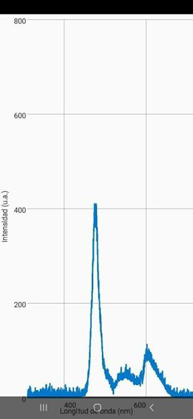

Espectrometria con smartphones
===========================

Esta aplicación fue desarrollada en el marco de la materia Laboratorio 6 de la
Facultad de Ciencias Exactas y Naturales de la Universidad de Buenos Aires.
En el Laboratorio de Óptica y Fotónica del Departamento de Física.

Introducción
------------

Espectrometria con smartphones hace posible medir espectros relativos en
telefonos celulares con calibraciones y correcciones automaticas. Se adaptó
el ejemplo de Camera2 de la documentación de Android para poder controlar 
la cámara.

Screenshots
-------------

 
